# Creating a Voxel Engine from Scratch

I wanted to document my progress in creating a voxel engine, so I've been doing that. It often helps me think to write about what I'm doing while I do it, more or less rubber duck debugging. I'm not really sure who it's written for besides myself, but ¯\\_(ツ)\_/¯ here it is. Each section has a Github link to the corresponding code. It's a diff between the code I started at (what was at the end of the last section) to what it is at the end of the given section. It's been a pretty interesting project. I really wasn't sure where to start, so after finding out what I could, I just started doing one thing after another based off of what made sense at the time. I'm more or less new to graphics programming in general, but a few basics can do quite a bit.

- [0 - Bootstrap the project](#0---bootstrap-the-project)
- [1 - Chunks](#1---chunks)
- [2 - Chunk loading and unloading](#2---chunk-loading-and-unloading)
- [3 - Meshing](#3---meshing)
- [4 - GUI](#4---gui)
- [5 - Multiple block types](#5---multiple-block-types)
- [5a - Chunk render optimization](#5a---chunk-render-optimization)
- [6 - Procedural generation](#6---procedural-generation)
- [7 - Lighting](#7---lighting)
- [8 - Shadows](#8---shadows)
- [9 - Day and Night](#9---day-and-night)
- [10 - Async Chunk Loading](#10---async-chunk-loading)
- [10a - Camera jump bug](#10a---camera-jump-bug)
- [11 - Multitexture Blocks](#11---multitexture-blocks)
- [12 - Scripting](#12---scripting)
- [12a - Fix the segfaults](#12a---fix-the-segfaults)

# 0 - Bootstrap the project

Code for this step: [initial-commit...000-bootstrap-the-project](https://github.com/boatrite/mutiny/compare/initial-commit...000-bootstrap-the-project)

We need a solid place to start. That means have a project setup and compiling, creating a window and an OpenGL context, and being able to render a few cubes, having a camera to fly around with.

To get to this point, I used [learnopengl.com](https://learnopengl.com/). It'll take you from no OpenGL knowledge to having enough to start rendering some voxels.

You should be able to render something like this after finishing the basic tutorial:

[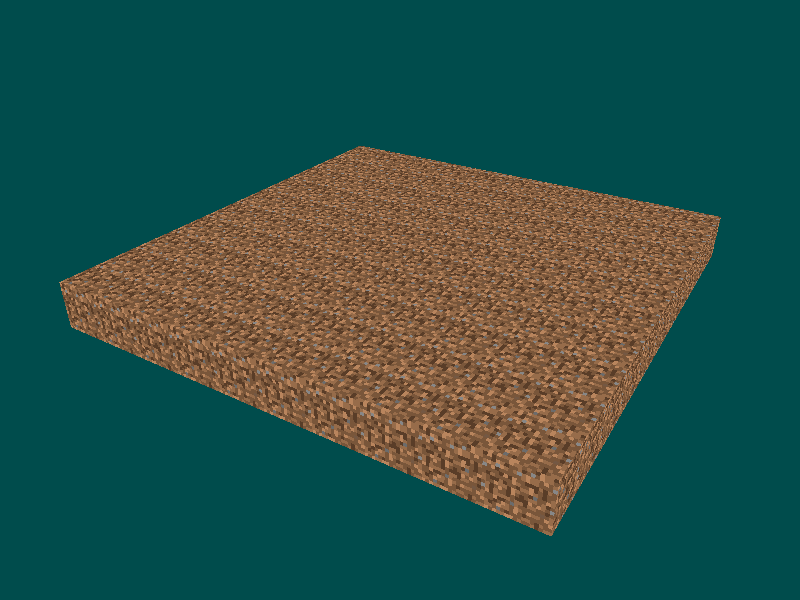](creating-a-voxel-engine-from-scratch/dirt_plane.png)

# 1 - Chunks

[000-bootstrap-the-project...001-chunks](https://github.com/boatrite/mutiny/compare/000-bootstrap-the-project...001-chunks)

Chunks are at the core of lots of systems in voxel engines, and as such we kinda need to add them first.

One of the things they do is allow efficient meshing -- that is, a way to efficiently turn 3d block data into a 1d array of triangle vertices. The idea is this: we need to efficiently turn 3d block data into triangles. It would be inefficient to take every block in the world and combine it into a single mesh, because every time any single block is placed or removed, we would have to regenerate the mesh for the entire world. The solution, is to create groups of blocks (i.e. chunks) to mesh individually, store the result, and only recompute the mesh when a block inside the chunk changes. This way, the vast majority of meshes are computed once and then stored, and only those chunks with changes become remeshed. This is why picking a "good" chunk size is important. Too large, and the remeshing will take a long time. Too small, and you'll still end up with tons of triangles. Chunk sizes of 16^3 or 32^3 are what I've seen most often.

Chunks are also used for world serialization. We need to be able to read data from disk and write data to disk in order to load and save the world. Chunks solve a similar problem here as in meshing. Were we to save each block's data to disk in its own file, we would spent a ridiculous amount of time reading and writing files to disk. Similarly, if we try to save the entire world's data in a single file, it would take forever to load and save that file (imagine trying to save that after every block change!). So again, we use a collection of blocks and save those together. I haven't implemented this myself yet, but from what I've read, even saving a whole chunk in a single file still causes far too many reads/writes to be performant. Instead, the concept of a "region" is introduced, which is a collection of chunks that are written and read together (I believe [Minecraft does this](https://minecraft.gamepedia.com/Region_file_format)).

While there are probably other benefits to chunking that I'm forgetting or not realizing at moment, this should be sufficient background to justify their existence and begin implementing them.

Right now, all I want to be able to do is render a 2x2 area of chunks, where each chunk is, let's say 16x16x16. That is, no generation, no loading, no culling, just the most basic chunk functionality I can imagine. I should be able to specify "present" or "absent" for each block in the chunk, and it should show up appropriately.

The general outline for how I did this is:

- Create a chunk class with nothing more than a render method, and move the render code for our plane to it. Chunks will have to render their own blocks/vertices, so this is a good first thing to do to make this area available to write future code in.
- Render an array of chunks. This will introduce the fact that chunks have a position. This position is normalized with respect to the chunk size so that the chunk position vectors won't have to change regardless of what the chunk size is. e.g. Two chunks next to each other might have positions (0, 0, 0) and (1, 0, 0). Not (0, 0, 0) and (16, 0, 0). - This also makes chunk position invariant with respect to where blocks are aligned in the chunk. More written about this later.
- Define the chunk's position's x and z to be the center of the chunk, and the chunk's position's y to be the bottom of the chunk
  - I liked the symmetry around the xz plane (i.e. the horizontal plane) and the fact that a chunk at the bottom of the map would start at y = 0 (if we define the bottom of the world at y = 0, which I am).
- Add an array of blocks to the Chunk class which store a 1 or 0, indicating whether the block at that position is present or absent.

* * *

See the code if you want info on the first bullet point, I don't think it's terribly complicated. It's basically a minor refactor. I'm going to expand on the rest which I think are more interesting.

So as I said, one of the things I did here was define chunk position invariant of chunk size or block alignment in the chunk. This should be a no brainer, but we definitely don't want to have to care about chunk size when we don't have to. I started out hard-coding chunk positions, so it would have been a real pain if I had to keep those in multiples of chunk size. As per the code, it was pretty trivial to add a translation to the block model matrix to render it in the correct world position based off of:

1. The position of the chunk
2. The position of the block within the chunk.

Similarly, I also aligned the blocks in the chunk in a way that made sense to me. Specifically, the chunk is centered on the x and z coordinates taking into account the chunk size. So for the chunk at (0, 0, 0), there are 8 blocks along -x and 8 blocks along +x, and the same for z. I also aligned the bottom of the chunk at the chunk's position's y. So for the chunk at (0, 0, 0), the bottom-most block is at y = 0, and the top-most block at +16 y. This was also easy to implement by translating the block model matrix in the render method.

I figured this made sense because if we consider the very bottom of the map at y = 0 (which is how I'm going to define the bottom of my world), that would also be the bottom of the chunk, and then we build up from there. Whereas for x and z, I like the symmetry of being centered around the chunk x and z. We'll see how well this works.

* * *

Now that that's working, the last thing to add is an array of blocks instead of just drawing a block at every position in the chunk.

I used a 1D array since it's just as easy and also faster than a 3D array. There is an easy way to compute the corresponding index of the 1D array from the x,y,z values of the block. This allows us to conceptually use x,y,z everywhere and then easily compute the actual array index when we need it.

For now, an array of 1s and 0s should be sufficient. If there is a 1, draw a block, if not, draw nothing.

I wrote up some temporary code to make each chunk filled with half a sphere, and this is the result. You should be able to get something similar now:

[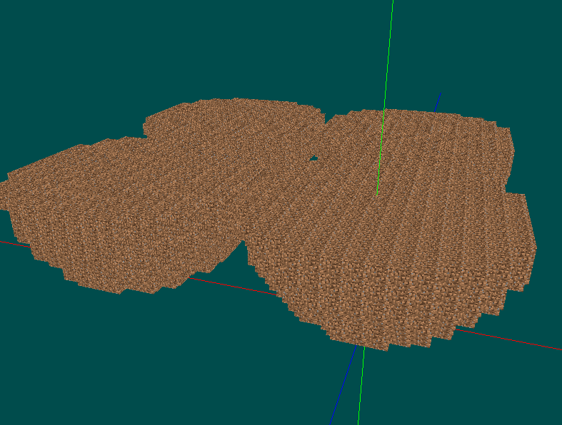](creating-a-voxel-engine-from-scratch/screenshot_13.png)

# 2 - Chunk loading and unloading

[001-chunks...002-chunk-loading-and-unloading](https://github.com/boatrite/mutiny/compare/001-chunks...002-chunk-loading-and-unloading)

Next, I think I want to figure out how to load and unload chunks. Since we aren't doing any sort of generation or reading from/writing to disk, it'll just be showing and hiding our single code-defined chunk.

Later, we'll start reading and writing the chunk and integrate that into our loading and unloading code, and later from that, we'll start doing chunk generation and integrate _that_ with our reading/writing/loading/unloading code.

* * *

The first thing I want to implement here is using a hashmap to store chunks. This appears to be a common implementation and should work for us for the immediate future. Since how I store chunks is going to be relevant once I start to get into loading and unloading them, we'll do this pre-work first.

C++11 has tuples, so I think I'm just going to use those as keys in the form of {x,y,z}. The values will be the Chunks. And as it turns out, I learned that C++ doesn't have a built-in way of getting the hash of a tuple, so there were some annoyances in getting that working, but nothing too bad. The relevant commits are in the code as always.

* * *

Then once that hashmap exists, we need to introduce the concept of a "render distance"/"viewing distance". With this chunk distance, we can get the "area of interest" around the camera, which is just (x +- distance, y +- distance, z +- distance).

Once we have the AoI, we use that to hide/show chunks as appropriate. Chunks inside the AoI are loaded if they aren't already, and chunks outside are unloaded if they aren't already.

The code to render inside the AoI is pretty straightforward, and then we'll handling actually deleting and creating next.

* * *

So anyways, given that we have an AoI and a hashmap of chunks, we simply need to check each location in the AoI, and if a chunk object exists, to fetch it and render it, and if it does not exist, to create it and render it. Chunks outside of the the AoI will be deleted, and if they get back in the AoI again, they'll be recreated.

I ran into quite a few issues with memory management. I ended up adding lots of debug code as you'll see in the commits. I basically put print statements in the copy constructor, destructor, and my normal constructor in order for me to show what method was called, in what order, and on which object (by printing the `this` pointer) so that I could figure out what was actually going on.

Anyways, after figuring out the memory issues -- by the way, I also disabled the copy and move constructors as well as the copy and move assignment operators, which should hopefully make it harder to make mistakes since the compiler will check me -- anyways, after doing that I was able to implement the loading and unloading logic without too many issues.

[](creating-a-voxel-engine-from-scratch/chunk-loading-unloading.gif)

# 3 - Meshing

[002-chunk-loading-and-unloading...003-meshing](https://github.com/boatrite/mutiny/compare/002-chunk-loading-and-unloading...003-meshing)

You might have noticed that using a large viewing distance basically tanks the performance (I could barely move in a viewing distance of 4 chunks). I think this is in part due to the larger number of triangles we render on every frame. To solve this, we need to get into meshing (see also: Isosurface Extraction) which is taking our voxel data and intelligently turning it into triangles to render.

Right now, we are generating triangles for every single visible cube. That's 12 triangles per cube, and it adds up fast.

There are a few algorithms to fix this, the [Wikipedia page](https://en.wikipedia.org/wiki/Isosurface) has some info on a few. [Marching Cubes](http://paulbourke.net/geometry/polygonise/) seems pretty popular; I've seen a few posts on [Dual Contouring](http://ngildea.blogspot.com/2014/09/dual-contouring-chunked-terrain.html); and I've also seen something called [Greedy Meshing](https://0fps.net/2012/06/30/meshing-in-a-minecraft-game/).

From what I can tell, Greedy Meshing will generate the "Minecraft style" blocks. i.e. No smooth surfaces. Marching Cubes and Dual Contouring on the other hand can generate both smooth surfaces and also support having 90 degree angles, which some other meshing algorithms do not support (like the Naive Surface Nets mentioned in Nick's Voxel Blog).

There's much more to learn about if you want smooth meshing, but I won't get into it here.

Since I don't really know much about the various costs and benefits, I think I'm just going to pick Greedy Meshing since it does what I want, looks pretty simple, and go from there.

* * *

Before we can even get to the point of implementing the meshing algorithm, we need to introduce a few more abstractions and write a bit more code to handle some things.

The rough order I did this in is:

- Move the VAO & VBO code into the chunk class since each chunk will eventually have different vertices to render.
- Figure out how to repeat texture data. Imagine we have a 16x1x16 flat chunk. The top face can be one giant quad composed of 2 triangles. However, we still need to render 16x16 textures to that face.
- Introduce the quads abstract and render a hardcoded list of quads with correct texture repeating. This is the boundary between the meshing algorithm and our code. We should get this working first so that we can easily test our meshing algorithm once implemented.
- Cache our generated mesh so we don't do it every frame. It should only happen when a chunk is loaded (generated or read from disk) or a block changes (block insertion/deletion is supported yet, but when it is)
- Introduce the meshing algorithm.

* * *

Having done that, there are some other improvements we can start thinking about, which I might look into next or at a later time. We'll see. But anyways, here's a list with some thoughts and/or links for future reference:

- Can we cull chunk faces that are next to each other?
  - Store duplicate voxel data in each chunk, the blocks right next to the edge, that we could use to occlusion check.
  - A possible `isBlockAt` method that takes the world position and handles checking blocks outside the current chunk. Since our other chunks are already loaded in memory, we could do something similar without too much trouble.
- Can we cull vertices that aren't visible from the current camera position?
  - Perhaps by implementing logic that looks at cube faces with respect to camera position, as mentioned [here](https://old.reddit.com/r/VoxelGameDev/comments/cj3kwi/heres_an_article_explaining_in_detail_how_i/evfzn05/).
  - Also by frustrum culling, to remove all vertices that aren't even in the camera's field of view.
  - Other culling? How about culling vertices hidden by other blocks (ray casting?)
- Add support for [meshing when we have multiple block types](https://0fps.net/2012/07/07/meshing-minecraft-part-2/).
- [Culling after adding cave generation](https://tomcc.github.io/2014/08/31/visibility-1.html)?
- Other optimizations I'm not even sure how to categorize [this](https://vercidium.com/blog/voxel-world-optimisations/).
- More stuff [here](https://old.reddit.com/r/VoxelGameDev/comments/cj3kwi/heres_an_article_explaining_in_detail_how_i/evd70sh/)
- Also, right now we store both `quads` and `quadMeshes`. This probably uses about 33% more memory than it needs to. We can discard the quads entirely after created the `quadMeshes`, or better yet, just create the `quadMesh` directly from the quad vertices directly in the meshing algorithm. I'm going to save this very easy optimization for later once we have proper profiling and can more easily see the benefits to our optimizations.

[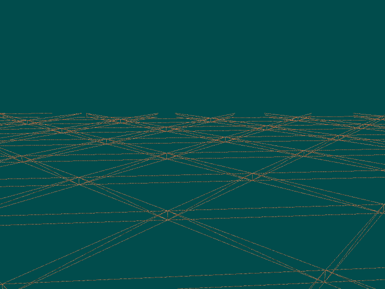](creating-a-voxel-engine-from-scratch/mesh_plane.png)

[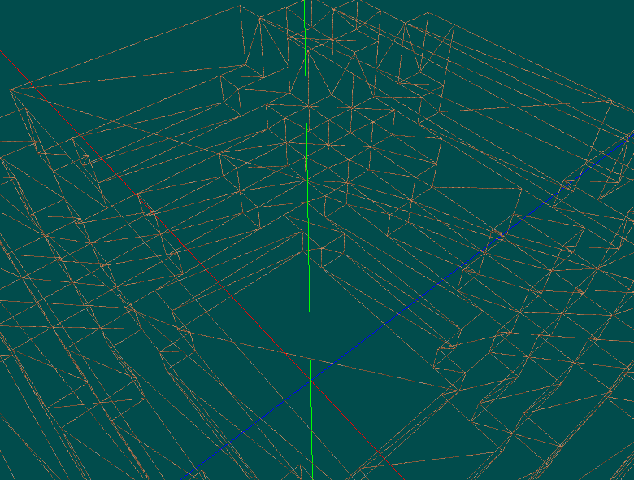](creating-a-voxel-engine-from-scratch/mesh_half_sphere.png)

# 4 - GUI

[003-meshing...004-gui](https://github.com/boatrite/mutiny/compare/003-meshing...004-gui)

This isn't really specific to voxel engines at all, but I'm writing a ton of code here to add basic debugging controls and output which I do not want to appear in another section's commits.

Take a look at the commits if you want, it's nothing terribly surprising.

One thing I didn't add right now, but think I will in the future is a command menu. I would like to be able to hit /, open up a text input to type a command (e.g. /wires, /axes, etc). This would be more convenient than having to use the mouse. Maybe I'll look into it when I get tired of clicking all the time.

[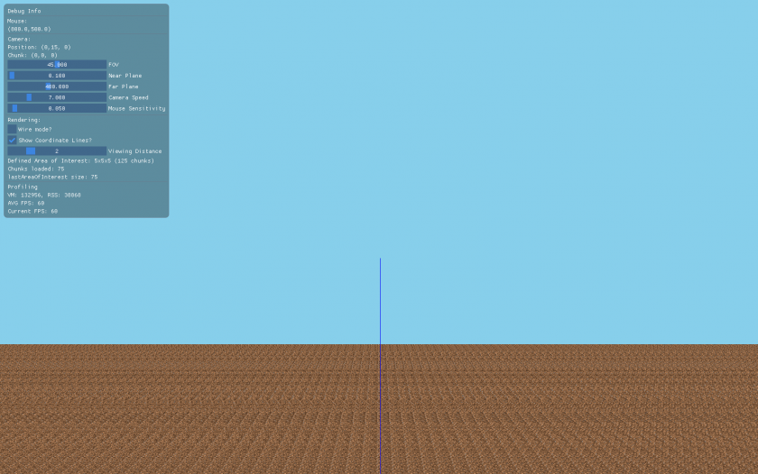](creating-a-voxel-engine-from-scratch/gui.png)

# 5 - Multiple block types

[004-gui...005-multiple-block-types](https://github.com/boatrite/mutiny/compare/004-gui...005-multiple-block-types)

Finally! We have a few things to do here

- Add a Block struct and define some BlockTypes
- Figure out how to render the correct texture based on the block type
  - Use some stubbed out quads here to test the rendering
- Update the meshing algorithm to handle multiple block types

This was a pretty heavy lift for me. When the meshing code was first added, it was almost completely copy-pasted and it mostly "just worked" without having to actually understand it. Now, however, I really dug in to try to figure out how it would have to be updated. After a few days, I did in fact come to understand the code, but all my ideas for implementing multi-block support did not pan out. It wasn't all sunk time though, because I was able to look at [this implementation](https://github.com/roboleary/GreedyMesh/blob/master/src/mygame/Main.java) which has multi-block support and is also based off of the same code ours is and basically copy in the relevant bits of code.

I don't totally understand the logic behind it, specifically that flip-flop which surrounds the entire previous algorithm. I think at its core though, it has to do with the fact that we need to get voxel information from both sides of the edges where a transition occurs. One of the things I learned pouring over the previous code is that the `mask` array was basically holding edge data. i.e. at this edge, was there a transition from absent to present or present to absent. The later code when reading the mask then used that to determine the quad sizing. The big difference now is that with multiple block types, we don't just have a single bit of data at the edge, we need to know the block type at both sides. This, I believe, is the core reason behind the flip-flop which wraps the entire previous algorithm. With that, we execute all the meshing twice, the first time looking at one side of the edge, and the next time looking at the other side.

The other minor changes are much more obvious. The fact that the height and width code is updated to check that the block type doesn't change is pretty obvious to me (my initial attempts tried something similar, although in a different way).

Something exciting about this change is that we now have face/directional information which I believe can be used to further optimize the culling. I'm not quite sure how this would work, but it's something to consider later on if we need to start working on performance optimizations.

[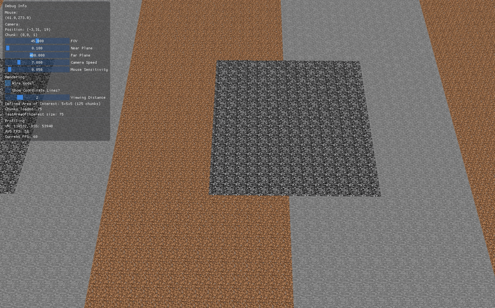](creating-a-voxel-engine-from-scratch/multiple-block-types.gif)

# 5a - Chunk render optimization

[005-multiple-block-types...005a-chunk-render-optimization](https://github.com/boatrite/mutiny/compare/005-multiple-block-types...005a-chunk-render-optimization)

You might have noticed that rendering a chunk with a lot of quads is substantially slower than one with fewer. The core issue is that each frame for each chunk we are looping over all quads in the chunk, sending that data to the gpu, then rendering.

The somewhat obvious fix is that we don't need separate arrays of all of the quads. Instead of reusing the same buffer with different arrays, we should just make one long array with everything and bind that.

In order to do this, there is some refactoring to the texture code required. The main issue is that right now we need to execute code to change the texture, but need the GPU to do it if we want to bind a single VBO with all the data. The solution I used is to use a 2d texture array with all of the textures and use an index, which can be sent with the vertex data to the gpu, to pick the correct one out of the array to render with.

# 6 - Procedural generation

[005a-chunk-render-optimization...006-procedural-generation](https://github.com/boatrite/mutiny/compare/005a-chunk-render-optimization...006-procedural-generation)

Since I want something super basic for now, I'm going to fill chunks at y = 0 and y = 1 completely with stone, then at y = 2 generate a heightmap to fill in using mostly stone with some dirt on top, then at y \> 2 have empty chunks.

One of the things that I was tricked up on is the fact that `GetNoise` will return zeroes at any integer coordinates. Apparently setting integer coords to zero and interpolating values in between somehow helps with generating coherent noise. At any rate, we can't just pass integer coordinates of our blocks into the function since the whole thing would just be flat. Even if we could get a value at integer coords, 1 is too large of a difference between coords to get smooth terrain. So instead, we line up the chunk position with the integer inputs of the noise function and subdivide the interval by the chunk size. This gives a 1/32 difference in inputs between blocks which is small enough to generate a somewhat smooth pattern which will suffice for now.

Another tiny gotcha is that `GetNoise` will return values in between -1 and 1. This might be inefficient, but I transform that interval to [0, 1] first then transform that to [0, CHUNK\_SIZE] to get a height.

Last note: it's pretty hard to discern the terrain since everything is evenly lit. I think I'll look into lighting somewhat soon in order to improve this.

[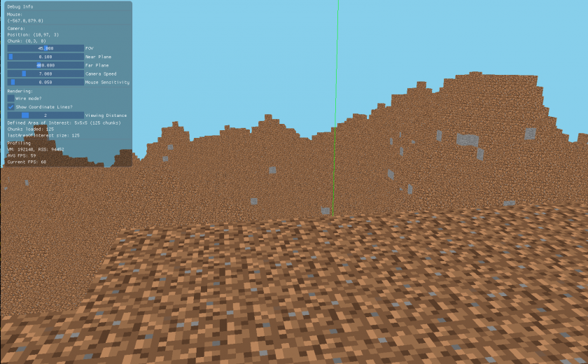](creating-a-voxel-engine-from-scratch/procgen.png)

# 7 - Lighting

[006-procedural-generation...007-lighting](https://github.com/boatrite/mutiny/compare/006-procedural-generation...007-lighting)

I followed the [LearnOpenGL tutorials](https://learnopengl.com/Lighting/Colors). It was very straightforward. I ended up implementing ambient, diffuse and specular lighting for directional and point lights. I'll probably add in spotlights at some point in the maybe near future, but didn't feel a big need to right now. I don't have anything to add to what the tutorial offered.

[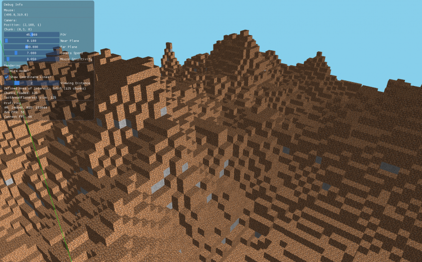](creating-a-voxel-engine-from-scratch/diffuse.png)[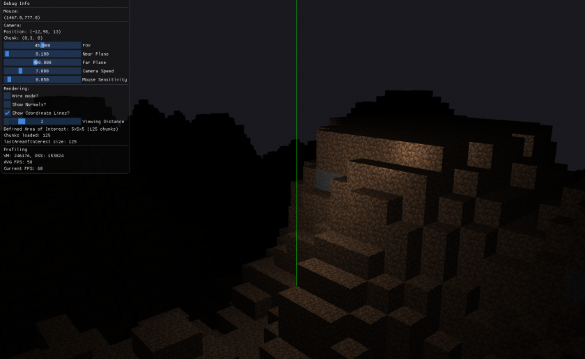](creating-a-voxel-engine-from-scratch/attenuation.png)[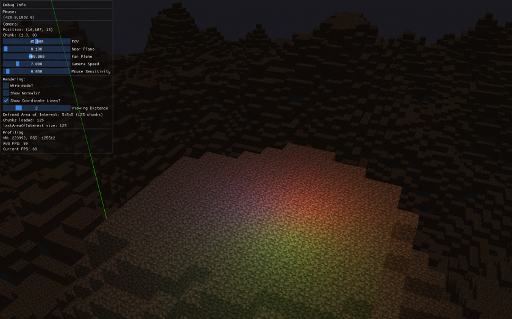](creating-a-voxel-engine-from-scratch/directional_and_point_lights.png)

# 8 - Shadows

[007-lighting...008-shadows](https://github.com/boatrite/mutiny/compare/007-lighting...008-shadows)

This, on the other hand, was not as straightforward as lighting. Again, the [LearnOpenGL tutorial](https://learnopengl.com/Advanced-Lighting/Shadows/Shadow-Mapping) was the the primary source I used to learn how to do this.

The most difficult thing to grok was the purpose of the orthographic projection (called `lightProjection` in the tutorial). One of the primary things to understand is that the cube created by the orthographic projection needs to contain basically the entire scene. Remember, what's in that cube is what the light "sees" and is what gets used in the shader later to determine whether something is in shadow. If an object is not in the ortho projection, it won't cast a shadow. I took the lazy route here and calculated the largest size the ortho would need to be based on the viewing distance. It's also important to calculate the light position correctly, which also depends on the viewing distance.

Furthermore, my use-case is complicated by the fact that the camera can move. That means we also need to move the light position as well with respect to the camera. Since the scene stays the same until a chunk boundary is crossed, all we need is the camera chunk position as opposed to the camera position by which we translate the light position to keep in centered on the scene. If we don't do this, as we move to chunks farther away from the center, we are going to start getting shadows with increasing angles.

Finally, the last weird thing I did was to fix shadow acne, and I fixed it by increasing the resolution of the shadow buffer to an absurd amount (16384 by 16384). The larger the render distance, the larger this needs to be. I tried some other values and I believe I started getting lag as soon as I doubled it to 32k by 32k. A more efficient solution which I _think_ would work is to use a cascaded shadow map (CSM) to render shadows accurately around the player (where we actually care about shadows) but less accurately far away.

To get this done, I added some debugging tools. One of them is rendering the depth map in the corner of the screen. This is based off of what the tutorial did, although in the tutorial it was eventually replaced instead of put into the corner and rendered simultaneously like I do.

I also added a sharper contrast mode using red and green to indicate shadows and no shadows respectively. This made it far easier to see what was going on since the shadows could blend in with the textures a bit, especially when there was shadow acne.

[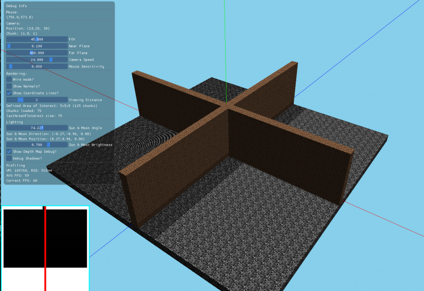](creating-a-voxel-engine-from-scratch/shadows_with_acne.png)[](creating-a-voxel-engine-from-scratch/shadows.gif)

# 9 - Day and Night

[008-shadows...009-day-night](https://github.com/boatrite/mutiny/compare/008-shadows...009-day-night)

Since I did all this work on lighting, I kinda figured I should try to get a proper day-night cycle going. I had pretty meh success. I learned some things, but the final result is kinda meh, and I don't feel like sinking more time into it.

Anyways, I did a simple interpolation of the sky color to change it from light to dark. I added both a sun and moon directional light to provide lighting in both the day and night. I render a texture for both sun and moon in the sky. Eh, that's about it.

I think what's more interesting is the problem I ran into where as light strength decreases, there is a point at which the ambient value for 2/3 of the faces become the same which effectively makes them indistinguishable which makes the whole scene appear flat and lose that 3d aspect. It's been a little bit now since I've actively thought about this, so I don't really have the entire context in my brain, but my instinct says this has got to be a simple fix for this. I tried a few things but no dice. I think I need to take a step back and think about it to figure it out.

[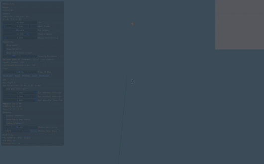](creating-a-voxel-engine-from-scratch/day-night-1.gif)[](creating-a-voxel-engine-from-scratch/day-night-2.gif)

# 10 - Async Chunk Loading

[009-day-night...010-async-chunk-loading](https://github.com/boatrite/mutiny/compare/009-day-night...010-async-chunk-loading)

Finally, I have async chunk loading. It was very easy to get a simple implementation working, but I did hit a few snags that are obvious in hindsight but missed on my first attempt.

That first attempt was to create a new thread every time we detected a new chunk needed to be loaded -- this logic already existed -- and inside of that thread generate and set the mesh.

I ran into two issues here. The first was more of a warning -- the code still compiled and executed but I got console errors -- caused by the fact that my Chunk render code assumed the VAO would be set already. Adding a simple check for the VAO being initialized solved that.

The more pernicious error was that my Chunk's `setMesh` function made OpenGL calls. It had been a while since I last worked on this, and I didn't immediately realize that my threads would attempting to make these calls. This doesn't work since the thread does not have the OpenGL context, so these calls segfault. There are apparently some ways to share an OpenGL context between threads and maybe even transfer a context between threads, but this just didn't seem like a path I wanted to go down, so I didn't research it further. Instead, I decided to keep all my OpenGL calls on the main thread and only generate the meshes and set that data on the Chunk object on the threads I spawn. I did this by adding a dirty flag that would also be set in the thread which the main thread would check to know whether it needed to re-send the data to the GPU. This worked out very well ([commit](https://github.com/boatrite/mutiny/commit/3ec013ddf2d2544bf3f84944e68a46ed5001f75c)).

However, while this worked well for small viewing distances (max of 4 is what worked for me), I started getting lag again when I had a viewing distance of 5+. This made sense to me since I now had thread creation/destruction overhead (which from what I read could possibly be non-trivial), as well as many threads trying to execute which would take resources away from the main thread, as well as the fact that in a single frame I would have many more dirty Chunks that would send their data to the GPU in a single frame. I didn't benchmark any of this, so I don't know the exact culprit, but I figured I would play with it and see what I learned.

At this time someone had suggested I look into thread pools and linked me [this library](https://github.com/vit-vit/ctpl). This seemed like a plausible way to solve all those problems at once. I would no longer have thread overhead (if that ever mattered). By limiting the number of threads available to a sane number, a larger viewing distance would no longer cause more threads to be created at once. And because of _that_, I would be limiting how many chunks become dirty at once, therefore limiting how many chunks have to send their data to the GPU in a single frame. To choose the number of threads I just experimented until I found a number that let me move with a viewing distance of 10 comfortably. After doing the very minor change of introducing and using the thread pooling library, I was able to move with my max viewing distance of 10 across chunk boundaries with zero pausing. Success!

Well, almost :P Having tested it out a bit, I will sometimes get a segfault. It _appears_ to happen when I cross a chunk boundary when there are other chunks loading. An easy way to reproduce is to make sure the available threads is somewhat lower (I found 5 worked well), run the binary, move viewing distance up to 10, and while the chunks are still loading to move forward across the chunk. This segfaults 100% of the time for me. More investigation needed!

Update: It turns out it is caused by the following sequence of events:

1. Move into a new chunk and get a ton of generate chunk threads queued up.
2. Keep moving and go into another new chunk
3. This causes some chunks to be deleted, which may include chunks that still have chunk generation threads that haven't been processed yet.
4. The chunk generation thread for a removed chunk is now ran, and this causes a segfault because the chunk no longer exists and the reference the thread has is invalid.

I brainstormed some solutions and tried some out, but it was a while ago now, and at any rate didn't come up with a perfect solution for this. I sort of had a solution that prevented the segfaults but would fail to remove chunks sometimes -- chunks would be loaded but not removed when moving out of range. I have some work in a branch [`wip-fix-orphaned-loaded-chunks-bug`](https://github.com/boatrite/mutiny/compare/010-async-chunk-loading...wip-fix-orphaned-loaded-chunks-bug).

At any rate, I don't really need to care about this edge case right now and am going to move on to more interesting things.

_These gifs are garbage but I think it's still possible to tell the difference. Sorry about that._

Before:

[](creating-a-voxel-engine-from-scratch/boundary-lag.gif)

After:

[](creating-a-voxel-engine-from-scratch/boundary-lag-fixed.gif)

# 10a - Camera jump bug

[010-async-chunk-loading...010a-camera-jump-bug](https://github.com/boatrite/mutiny/compare/010-async-chunk-loading...010a-camera-jump-bug)

This is another quality of life thing I'd been putting off and decided to do know before moving onto other things.

Basically, what happens is that when switching between the two control modes (one with mouse for interacting with GUI, another without mouse for controlling the camera in-game), the cursor calculations get wonked up. This is similar to an issue fixed when I first introduced the camera and the solution will be similar in that we need to treat the first movement in a particular way to make sure the math checks out.

# 11 - Multitexture Blocks

[010a-camera-jump-bug...011-multitexture-blocks](https://github.com/boatrite/mutiny/compare/010a-camera-jump-bug...011-multitexture-blocks)

Finally turning my dirt wasteland into something more green. Conceptually, this was very easy. I already have a function that takes a block type and turns it into a texture index to render. I already know what side I'm on when meshing. All I had to do was load up some more textures, look them up by both block type and side, and there we go.

Of course, I did make it more complicated for myself which may or may not have been a good idea. I decided to stop hardcoding block data in source code and move it to a yaml file instead. This really shouldn't have been that difficult or taken as long as it did, but for me who is not efficient at writing C++ code it took a bit of effort.

I also got sloppy with git and so my rename refactoring is just in the same commit where I load the block data from file which is in the same commit I add in multiple texture support. It is what it is, and I eventually got it working (with way more effort than if I had proceeded more mindfully).

[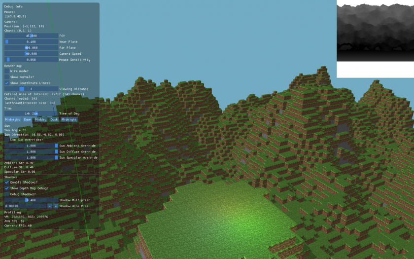](creating-a-voxel-engine-from-scratch/multitexture_blocks.png)

# 12 - Scripting

[011-multitexture-blocks...012-scripting](https://github.com/boatrite/mutiny/compare/011-multitexture-blocks...012-scripting)

This was a huge lift because I had to learn mruby, specifically the C api which is not documented aside from the source (although to be fair the source is really good to look through and learn from). Also updated the build system a bit. Moved block definitions and world gen to ruby. Came up with basic mod/content pack/whatever concept to load arbitrary bundles of ruby. Made some small world gen improvements using the new ruby api. This section is more resource and code heavy, as it's basically some stream of consciousness summaries I wrote after I got something working.

* * *

Resources:

- [mruby repo](https://github.com/mruby/mruby)
  - [Compile](https://github.com/mruby/mruby/blob/master/doc/guides/compile.md). Need to compile mruby to get the archive file libmruby.a which we link in to the C++ application.
  - [How to Use the mruby Debugger](https://github.com/mruby/mruby/blob/master/doc/guides/debugger.md). Always relevant.
  - [Limitations and Differences](https://github.com/mruby/mruby/blob/master/doc/limitations.md). Differences between CRuby and mruby.
  - [Gems](https://github.com/mruby/mruby/blob/master/doc/guides/mrbgems.md)
    - [This part](https://github.com/mruby/mruby/blob/master/doc/guides/mrbgems.md#c-extension) of the gems doc shows a simple example of how to make a C++ function callable in Ruby using `mrb_define_class_method`
  - I've gotten a lot of value reading the mruby source.
    - [mruby.h](https://github.com/mruby/mruby/blob/master/include/mruby/data.h). Lots of documentation in this file, has a lot of the "core" methods. Like methods that create classes, define methods, call methods on objects/classes, etc.
    - [array.h](https://github.com/mruby/mruby/blob/master/include/mruby/array.h). Arbitrarily opened this file to poke around and got a lot of value from reading a full example of "here is how to make a complex thing available in Ruby". Seeing what the C code is that creates the corresponding Ruby code will likely be very useful for writing my own.
      - Arrays are particularly relevant too since that's an important thing.. Maybe it's a lot easier than I think to have an array of strings or array of structs used in both C++ and ruby.
- mruby [API docs](http://mruby.org/docs/api/)
- [List of gems](http://mruby.org/libraries/)
- A hello world [example](http://mruby.org/docs/articles/executing-ruby-code-with-mruby.html)
- [mrubybind](https://github.com/ktaobo/mrubybind) for easily calling methods and passing simple types between ruby and c++
- AnthonySuper's ["mruby, C++, and Template Magic"](https://anthony.noided.media/blog/programming/c++/ruby/2016/05/12/mruby-cpp-and-template-magic.html) on passing advanced types between ruby and c++
  - [mrb\_wrapper.hpp](https://github.com/AnthonySuper/Experimental-2D-Engine/blob/master/include/mrb_wrapper.hpp)
  - [script\_engine.hpp](https://github.com/AnthonySuper/Experimental-2D-Engine/blob/master/include/script_engine.hpp)
  - [script\_engine.cpp](https://github.com/AnthonySuper/Experimental-2D-Engine/blob/master/src/script_engine.cpp)
  - Corresponding reddit [post](https://www.reddit.com/r/cpp/comments/4kourc/using_templates_to_bind_mruby_into_a_c_program/)
  - Corresponding github [repo](https://github.com/AnthonySuper/Experimental-2D-Engine)
- StackOverflow [post](https://stackoverflow.com/questions/30689643/calling-mruby-vm-in-c) about calling a method on an mrb\_value
- This [series](https://dev.to/roryo/storing-c-data-in-an-mruby-class-50k4). That specific post is about sharing data between C++ and Ruby, and is another good example for how I might create C++ objects from Ruby.
- [Here's another](https://github.com/Secretchronicles/TSC/blob/devel/tsc/src/scripting/scripting.hpp) application which uses mruby as a scripting engine. Might have a lot of useful code to read.

More:

- [StackOverflow posts tagged "mruby"](https://stackoverflow.com/questions/tagged/mruby). I haven't looked into this, but it could be worth browsing and/or searching through.

* * *

I've been reading about mruby and am now getting around to actually adding it in, so I figured I'd write up what I'm doing.

I just downloaded mruby-2.1.1 and compiled it by running `rake` and it worked without issue. I copied the two `.a` files to my project's vendor directory (where I store precompiled `.a` files). I added `libmruby.a` to my Makefile's compiler options.

I copied the mruby include directory to my project and was able to compile it with code similar to their [example](http://mruby.org/docs/articles/executing-ruby-code-with-mruby.html).

```
mrb_state *mrb = mrb_open();
if (!mrb) { return 1; }
mrb_load_string(mrb, "puts 'Hello, World!'");
mrb_close(mrb);
```

And now there's a minimal working mruby example to expand on.

* * *

Next up I definitely want to write code in actual ruby files and not C++ strings, so I'll get that working.

I wrote up a small File util to give a nice and easy way to read contents from a file and there it is:

```
std::string fileContents = File::read("./scripts/hello_world.rb");
const char* rubyCode = fileContents.c_str();
mrb_load_string(mrb, rubyCode);
```

I also refactored the Shader code to use this new File::read util. I just found out that there is an `mrb_load_file` method (defined in compile.h), but whatever.

* * *

Next I stumbled my way through figuring out how to pull data out of an array created in ruby.

Looking at the definition for mrb\_load\_string, it returns an `mrb_value`, so that's how we can get our array's value in C++. Then I used some macro to turn that from an `mrb_value` into an `RArray*`. That was sort of a guess based off of something else I saw somewhere else. After which I could pull data out of the RArray struct.

```
CHUNK_SIZE = 32;
CHUNK_SIZE_SQUARED = CHUNK_SIZE * CHUNK_SIZE;

class ChunkGenerator
  def self.flat(position)
    y = 0
    blocks = []
    CHUNK_SIZE.times do |x|
      CHUNK_SIZE.times do |z|
        index = z * CHUNK_SIZE_SQUARED + y * CHUNK_SIZE + x
        blocks[index] = "dirt"
      end
    end
    blocks
  end
end

ChunkGenerator.flat("foobar")
```

```
std::string fileContents = File::read("./src/scripts/environment.rb");
const char* rubyCode = fileContents.c_str();
mrb_value testValue = mrb_load_string(mrb, rubyCode);
RArray* myArray = RARRAY(testValue);
std::cout << myArray->as.heap.len << std::endl;
```

I can also use the C array methods to get an item at a specific index.

```
std::string fileContents = File::read("./src/scripts/environment.rb");
const char* rubyCode = fileContents.c_str();
mrb_value testValue = mrb_load_string(mrb, rubyCode);
mrb_value firstElement = mrb_ary_ref(mrb, testValue, 0);
std::cout << mrb_string_p(firstElement) << std::endl; // Print whether firstElement is a string
mrb_p(mrb, firstElement);
const char* myCStr = mrb_string_cstr(mrb, firstElement);
std::cout << myCStr << std::endl;
```

So there's a rudimentary ability to pull values out of ruby.

* * *

Here's a refactor that makes it less dumb. Obviously remove the call to ChunkGenerator from the ruby file now that we're doing it here.

```
std::string fileContents = File::read("./src/scripts/environment.rb");
const char* rubyCode = fileContents.c_str();
mrb_load_string(mrb, rubyCode);
mrb_value testValue = mrb_load_string(mrb, "ChunkGenerator.flat('foobar')");
```

This is a much nicer way of pulling data out of ruby. First load up our environment, then call the method we just defined when loading the environment.

I think I'll get rid of the argument for now (since flat doesn't need it anyways), and update the engine to use a ruby string instead of passing around the C++ std::function, and I should be able to get an MVP of using ruby as world gen.

* * *

I updated the code so that Renderer now keeps track of the mrb\_state pointer. I pass it into the Chunk contructor and run the ruby to generate the chunk there, then pull out the block ids from the ruby array and make WorldBlock structs with the ids.

I converted over all chunk gen except perlin, which currently uses a library, so I'm going to make some bindings for that so I can call it in ruby.

This isn't the nicest looked code, but:

```
noise::module::Perlin perlinNoise;

#pragma GCC diagnostic push
#pragma GCC diagnostic ignored "-Wunused-parameter"
mrb_value perlin_get_value(mrb_state *mrb, mrb_value self) {
  double x {}, y {}, z {};
  mrb_get_args(mrb, "fff", &x, &y, &z);
  return mrb_float_value(mrb, perlinNoise.GetValue(x, y, z));
}
#pragma GCC diagnostic pop
```

The last 4 lines are the new lines added to the mruby VM initialization section of the code.

```
// Initialize the mruby VM
mrb_state *mrb = mrb_open();
m_mrb = std::shared_ptr<mrb_state>(mrb);

// Load in our ruby application environment into the VM
std::string fileContents = File::read("./src/scripts/environment.rb");
const char* rubyCode = fileContents.c_str();
mrb_load_string(m_mrb.get(), rubyCode);

// I also need to do a bunch of binding to C++ methods.
// Possibly use mrubybind for this
RClass *PerlinNoise_class = mrb_define_class(m_mrb.get(), "PerlinNoise", m_mrb->object_class);
mrb_define_class_method(m_mrb.get(), PerlinNoise_class, "get_value", perlin_get_value, MRB_ARGS_REQ(3));
```

* * *

I get lag spikes when crossing chunk boundaries again, and guess what I noticed. I do chunk generation in the main thread. And now that there's all this other code, it takes long enough that it lags for a bit. So I moved that to the same thread that does the meshing (I just do the generation first), and that sorta worked. The thing is, mruby is not multithread safe. So only a single thread can be doing something on the mrb\_state at a time. But I want to keep my thread pool count at a higher number and not 1, so really the only solution I could find was to [spin up an entire new mrb vm](https://github.com/mruby/mruby/issues/5005)... And it totally works. Perf looks fine so far, but I haven't stress tested it.

* * *

Next up I automated my mruby compilation to make it easier to add new gems (which require a recompilation since that's how mruby gems work).

I copied the mruby-2.1.1 directory into my project and gitignored it.

Added a few make tasks

```
mruby:
	cd ./mruby-2.1.1 && rake

./vendor/libmruby.a: ./mruby_build_config.rb
	make mruby
	cp mruby-2.1.1/build/host/lib/libmruby.a vendor/libmruby.a
```

You can see I created a new file `mruby_build_config.rb` in my project's root directory. This is actually the `build_config.rb` file that _was_ in the `mruby-2.1.1` dir, but I moved it out, renamed it, and then symlinked it back in. This let's me check in my mruby build config into source control, which I absolutely want to do, without having to check in all the mruby source.

Now I have an easy way to get the updated `libmruby.a` file whenever I add a new gem. Like `mruby-require` which was the impetus for doing this.

I refactored and automated my build system a bit more. There are tasks to download the mruby and libnoise source if it's not present, configure the mruby source, and compile the mruby and libnoise libraries and move the archive files into place.

* * *

Now that my mruby has mruby-require, I split my environment.rb into that and chunk\_generator.rb, so there's a proof of concept for how require works. Next up, I need to define some constants in the VM that are available in C++, specifically the CHUNK\_SIZE constants.

```
mrb_define_const(mrb, mrb->kernel_module, "CHUNK_SIZE", mrb_fixnum_value(CHUNK_SIZE));
mrb_define_const(mrb, mrb->kernel_module, "CHUNK_SIZE_CUBED", mrb_fixnum_value(CHUNK_SIZE_CUBED));
mrb_define_const(mrb, mrb->kernel_module, "CHUNK_SIZE_SQUARED", mrb_fixnum_value(CHUNK_SIZE_SQUARED));
mrb_define_const(mrb, mrb->kernel_module, "CHUNK_SIZE_HALVED", mrb_fixnum_value(CHUNK_SIZE_HALVED));
mrb_define_const(mrb, mrb->kernel_module, "CHUNK_SIZE_QUARTERED", mrb_fixnum_value(CHUNK_SIZE_QUARTERED));
```

* * *

Added an easy way to load a string and check if there were errors. Kept the api similar to the C style.

mrbext.h

```
#pragma once

#include <mruby.h>

mrb_value mrbext_load_and_check_string(mrb_state *mrb, const char *c_str);
```

mrbext.cpp

```
#include <cstdlib>

#include <mruby/compile.h>

#include "mrbext.h"

mrb_value mrbext_load_and_check_string(mrb_state *mrb, const char *code) {
  mrb_value mrbResult = mrb_load_string(mrb, code);
  if (mrb->exc) { // If there is an error
    if (!mrb_undef_p(mrbResult)) {
      mrb_print_error(mrb); // print exception object
      exit(1);
    }
  }
  return mrbResult;
}
```

Using this and mruby-require give us an easy way to execute a chunk of ruby code and get line numbers if there's an error: `mrbext_load_and_check_string(mrb, "require './src/scripts/environment'");`. Here I load in my environment.rb which currently contains all my ruby.

* * *

Next up I moved the block definitions and block config file loading into ruby. And got rid of the mini-yaml C++ library (since it's all be in ruby).

I talked a bit about spinning up multiple ruby VMs so that I can run ruby snippets in multiple threads. Sometimes I find it useful to store a long existing mrb\_state\* as a static class member, and sometimes they are short lived getting created and closed within a method call.

It seems both approaches are useful so far. Right now, each VM includes all ruby and C extensions. I'm not sure whether I'll eventually want to speciallize multiple different types of VMs (like one specifically to be used in Chunk, and another in Texture) or whether having a single, generic, all ruby included VM will be better. Latter seems simpler, so I'm doing that for now, but if I eventually have a serious ton of ruby and things like generation/meshing seem slow, I could always see if only loading what's required makes it faster.

I'm doing a fair bit of metaprogramming in ruby to get a "nice" dsl for adding blocks. It'll probably change a lot as I use it more.

I have separate locations for "engine" scripts and "user" scripts (i.e. mods, packs, whatever). Engine scripts are what's required to support the modding api and help bridge between the C++ and the Ruby. Right now all user scripts are required in alphabetical order when the VM starts.

I moved the texture assets the the user scripts dir. Refactored some of the ruby. Got to the point where I want to actually use the new scripting abilities to do smarter worldgen. Specifically, grass blocks being only used when there is not a block directly on top of it. And after that, trees.

* * *

Well the first obvious thing to do is just make trees completely inside the chunk first. So I did that. Also fixed my grass. And added a little bit to start testing cross-chunk structures. Anything more advanced, specifically solving cross-chunk worldgen is going to require some serious lifting. I have some ideas but won't get into it now, so this section will wrap up now with those smaller worldgen changes.

I would like to find out if I can figure out how to _not_ clone the array in Chunk::generate. If I can somehow get that data instead of cloning, I could possibly do some of the WorldBlock stuff in ruby as well.

Oh yeah, segfault issues are starting to get worse, kinda unusable since moving around can crash only after a couple of seconds. So yeah look into that too.

* * *

Some screenshots of new worldgen:

[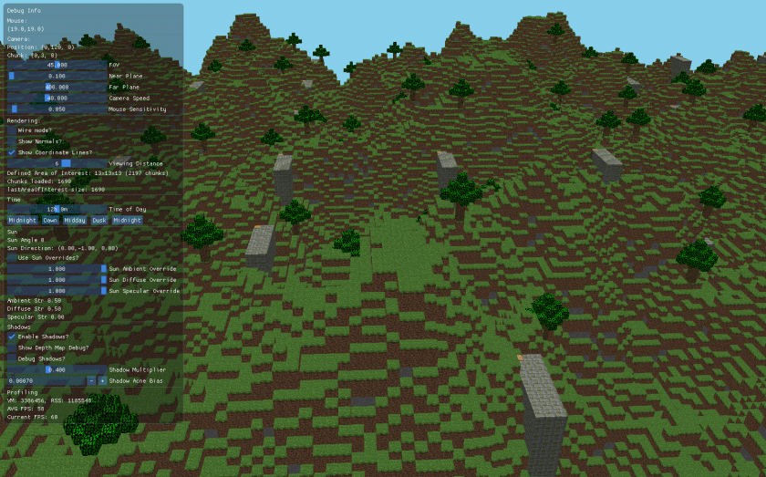](creating-a-voxel-engine-from-scratch/scripted_worldgen.png)

# 12a - Fix the segfaults

[012-scripting...012a-fix-segfaults](https://github.com/boatrite/mutiny/compare/012-scripting...012a-fix-segfaults)

Finally, I have a good solution to fix the segfaulting that's been plaguing me forever. It was pretty simple, and maybe in hindsight obvious? Either way, a good learning C++ moment. In my `chunks` map, I replaced the values which were `Chunk`s with a shared pointer to the Chunk object (`std::shared_ptr<Chunk>`). Now, I can still call `chunks.erase`, but passing it the the shared pointer instead of the object directly. So when I have a thread that now runs after erase has been called -- and since it was given the shared pointer now instead of a reference to the Chunk -- the Chunk object is still around and the thread successfully completes. It of course throws away all the work we did since the shared pointer no longer is referenced anywhere so the Chunk instance is deleted, but that's totally okay for now.