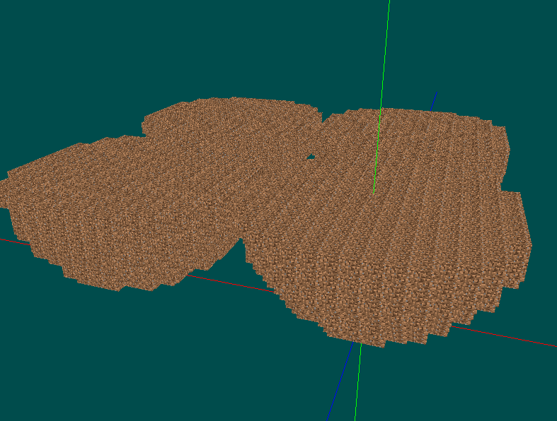
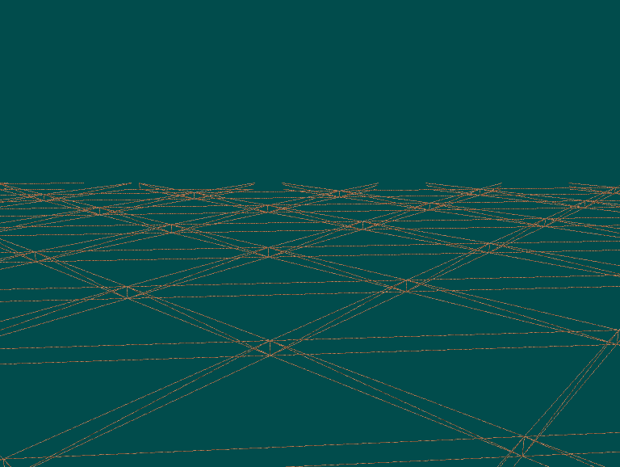
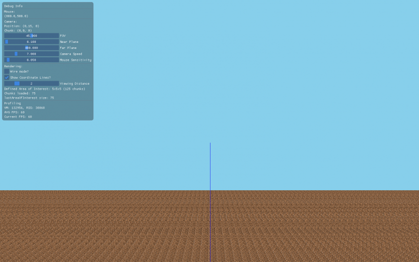
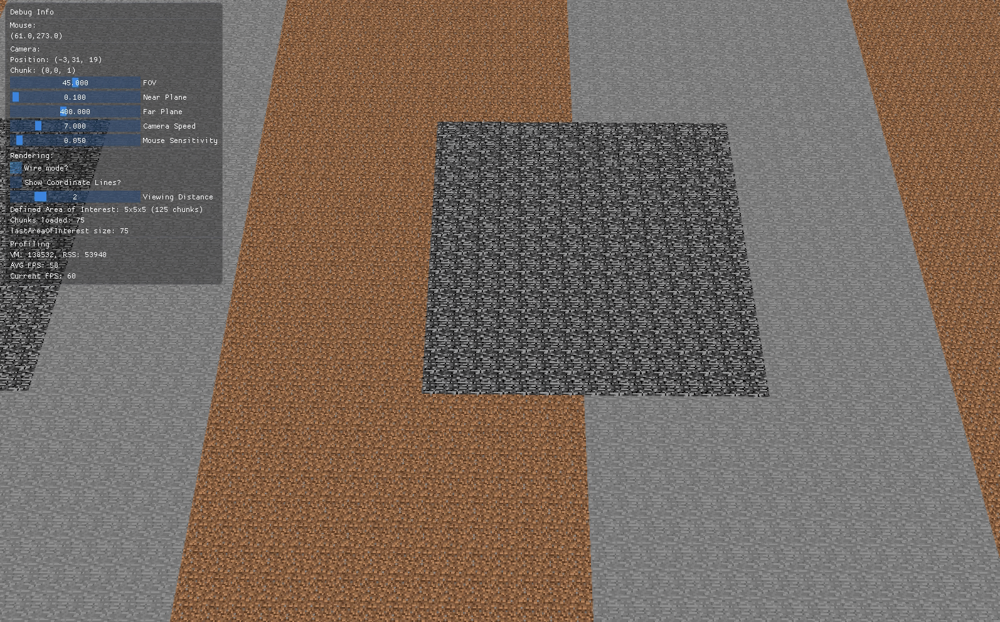
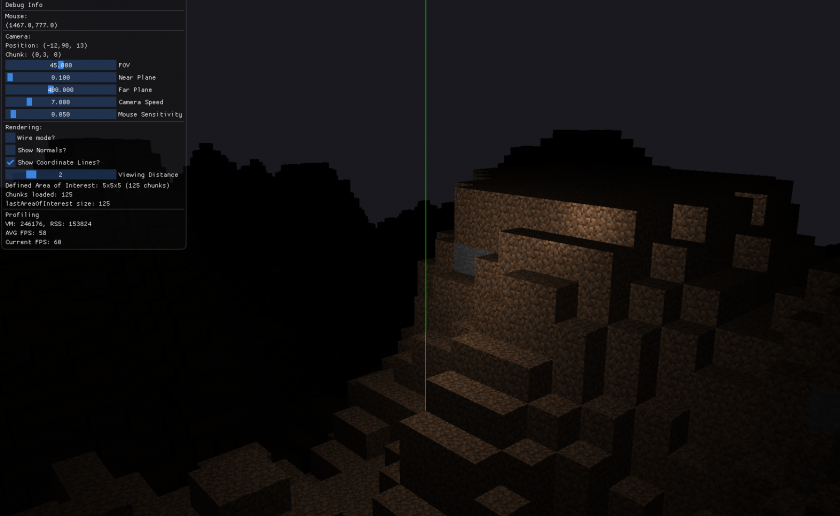
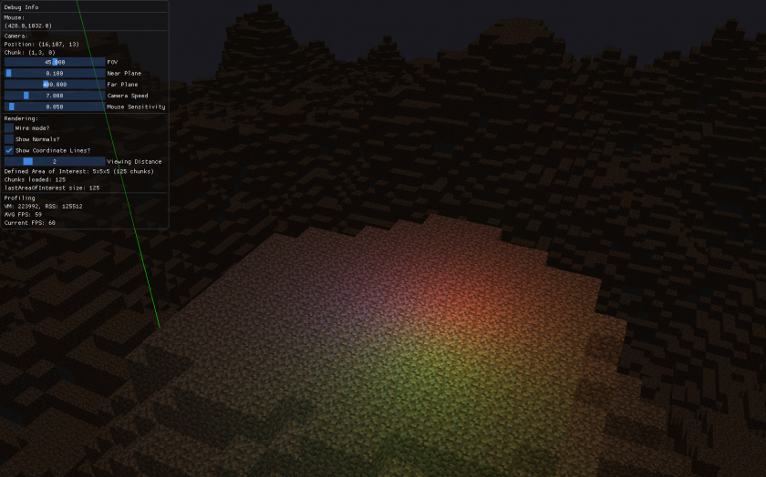
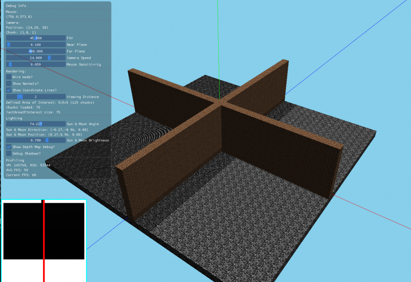

**Table of Contents**

* [Creating a Voxel Engine from Scratch](#creating-a-voxel-engine-from-scratch)
* [0 - Bootstrap the project](#0---bootstrap-the-project)
* [1 - Chunks](#1---chunks)
* [2 - Chunk loading and unloading](#2---chunk-loading-and-unloading)
* [3 - Meshing](#3---meshing)
* [4 - GUI](#4---gui)
* [5 - Multiple block types](#5---multiple-block-types)
* [5a - Chunk render optimization](#5a---chunk-render-optimization)
* [6 - Procedural generation](#6---procedural-generation)
* [7 - Lighting](#7---lighting)
* [8 - Shadows](#8---shadows)
* [9 - Day and Night](#9---day-and-night)
* [To Do:](#to-do)
* [Resources](#resources)

# Creating a Voxel Engine from Scratch

It is next to impossible to find a thorough resource on how to do this, so I guess I'll pull a bunch together to figure it out and write about what I learn.

Ideally, I can write this in such a way that it's useful to other people.

The main issue I have right now is that I have no idea what order to do anything in. Lots of resources assume a certain amount of knowledge or are about a specific bit of functionality.

I'm going to assume general programming and OpenGL knowledge, but anything related to voxel development itself, I will ideally write about in more detail. Basically, what I would have loved to have as a step-by-step tutorial.

My idea is that while there will be a lot of source code written, I'll just link to it on Github. I'll try to make the commits atomic enough to be understandable by themselves. I'll then use the space here to write about the concepts involved, specifically the order in which I implement certain functionality. There are lots of concerns: chunks, rendering efficiency, world saving/serialization, chunk loading/unloading, chunk generation, ... and so much more.

And of course, what I'm going to be doing is just what I figure out. It probably won't be the best or most efficient or create the engine you might want, but when you know nothing the best thing to do is just start and use what you learn later on to make what you really want. That's my plan at least :)

So here we go.

# 0 - Bootstrap the project

Code for this step: [initial-commit...000-bootstrap-the-project](https://github.com/boatrite/mutiny/compare/initial-commit...000-bootstrap-the-project)

We need a solid place to start. That means have a project setup and compiling, creating a window and an OpenGL context, and being able to render a few cubes, having a camera to fly around with.

To get to this point, I used [learnopengl.com](https://learnopengl.com/). It'll take you from no OpenGL knowledge to having enough to start rendering some voxels.

You should be able to render something like this after finishing the basic tutorial:

# 1 - Chunks

[000-bootstrap-the-project...001-chunks](https://github.com/boatrite/mutiny/compare/000-bootstrap-the-project...001-chunks)

Chunks are at the core of lots of systems in voxel engines, and as such we kinda need to add them first.

One of the things they do is allow efficient meshing -- that is, a way to efficiently turn 3d block data into a 1d array of triangle vertices. The idea is this: we need to efficiently turn 3d block data into triangles. It would be inefficient to take every block in the world and combine it into a single mesh, because every time any single block is placed or removed, we would have to regenerate the mesh for the entire world. The solution, is to create groups of blocks (i.e. chunks) to mesh individually, store the result, and only recompute the mesh when a block inside the chunk changes. This way, the vast majority of meshes are computed once and then stored, and only those chunks with changes become remeshed. This is why picking a "good" chunk size is important. Too large, and the remeshing will take a long time. Too small, and you'll still end up with tons of triangles. Chunk sizes of 16^3 or 32^3 are what I've seen most often.

Chunks are also used for world serialization. We need to be able to read data from disk and write data to disk in order to load and save the world. Chunks solve a similar problem here as in meshing. Were we to save each block's data to disk in its own file, we would spent a ridiculous amount of time reading and writing files to disk. Similarly, if we try to save the entire world's data in a single file, it would take forever to load and save that file (imagine trying to save that after every block change!). So again, we use a collection of blocks and save those together. I haven't implemented this myself yet, but from what I've read, even saving a whole chunk in a single file still causes far too many reads/writes to be performant. Instead, the concept of a "region" is introduced, which is a collection of chunks that are written and read together (I believe [Minecraft does this](https://minecraft.gamepedia.com/Region_file_format)).

While there are probably other benefits to chunking that I'm forgetting or not realizing at moment, this should be sufficient background to justify their existence and begin implementing them.

Right now, all I want to be able to do is render a 2x2 area of chunks, where each chunk is, let's say 16x16x16. That is, no generation, no loading, no culling, just the most basic chunk functionality I can imagine. I should be able to specify "present" or "absent" for each block in the chunk, and it should show up appropriately.

The general outline for how I did this is:

- Create a chunk class with nothing more than a render method, and move the render code for our plane to it. Chunks will have to render their own blocks/vertices, so this is a good first thing to do to make this area available to write future code in.
- Render an array of chunks. This will introduce the fact that chunks have a position. This position is normalized with respect to the chunk size so that the chunk position vectors won't have to change regardless of what the chunk size is. e.g. Two chunks next to each other might have positions (0, 0, 0) and (1, 0, 0). Not (0, 0, 0) and (16, 0, 0). - This also makes chunk position invariant with respect to where blocks are aligned in the chunk. More written about this later.
- Define the chunk's position's x and z to be the center of the chunk, and the chunk's position's y to be the bottom of the chunk 
  - I liked the symmetry around the xz plane (i.e. the horizontal plane) and the fact that a chunk at the bottom of the map would start at y = 0 (if we define the bottom of the world at y = 0, which I am).
- Add an array of blocks to the Chunk class which store a 1 or 0, indicating whether the block at that position is present or absent.

* * *

See the code if you want info on the first bullet point, I don't think it's terribly complicated. It's basically a minor refactor. I'm going to expand on the rest which I think are more interesting.

So as I said, one of the things I did here was define chunk position invariant of chunk size or block alignment in the chunk. This should be a no brainer, but we definitely don't want to have to care about chunk size when we don't have to. I started out hard-coding chunk positions, so it would have been a real pain if I had to keep those in multiples of chunk size. As per the code, it was pretty trivial to add a translation to the block model matrix to render it in the correct world position based off of:

1. The position of the chunk
2. The position of the block within the chunk.

Similarly, I also aligned the blocks in the chunk in a way that made sense to me. Specifically, the chunk is centered on the x and z coordinates taking into account the chunk size. So for the chunk at (0, 0, 0), there are 8 blocks along -x and 8 blocks along +x, and the same for z. I also aligned the bottom of the chunk at the chunk's position's y. So for the chunk at (0, 0, 0), the bottom-most block is at y = 0, and the top-most block at +16 y. This was also easy to implement by translating the block model matrix in the render method.

I figured this made sense because if we consider the very bottom of the map at y = 0 (which is how I'm going to define the bottom of my world), that would also be the bottom of the chunk, and then we build up from there. Whereas for x and z, I like the symmetry of being centered around the chunk x and z. We'll see how well this works.

* * *

Now that that's working, the last thing to add is an array of blocks instead of just drawing a block at every position in the chunk.

I used a 1D array since it's just as easy and also faster than a 3D array. There is an easy way to compute the corresponding index of the 1D array from the x,y,z values of the block. This allows us to conceptually use x,y,z everywhere and then easily compute the actual array index when we need it.

For now, an array of 1s and 0s should be sufficient. If there is a 1, draw a block, if not, draw nothing.

I wrote up some temporary code to make each chunk filled with half a sphere, and this is the result. You should be able to get something similar now:

# 2 - Chunk loading and unloading

[001-chunks...002-chunk-loading-and-unloading](https://github.com/boatrite/mutiny/compare/001-chunks...002-chunk-loading-and-unloading)

Next, I think I want to figure out how to load and unload chunks. Since we aren't doing any sort of generation or reading from/writing to disk, it'll just be showing and hiding our single code-defined chunk.

Later, we'll start reading and writing the chunk and integrate that into our loading and unloading code, and later from that, we'll start doing chunk generation and integrate _that_ with our reading/writing/loading/unloading code.

* * *

The first thing I want to implement here is using a hashmap to store chunks. This appears to be a common implementation and should work for us for the immediate future. Since how I store chunks is going to be relevant once I start to get into loading and unloading them, we'll do this pre-work first.

C++11 has tuples, so I think I'm just going to use those as keys in the form of {x,y,z}. The values will be the Chunks. And as it turns out, I learned that C++ doesn't have a built-in way of getting the hash of a tuple, so there were some annoyances in getting that working, but nothing too bad. The relevant commits are in the code as always.

* * *

Then once that hashmap exists, we need to introduce the concept of a "render distance"/"viewing distance". With this chunk distance, we can get the "area of interest" around the camera, which is just (x +- distance, y +- distance, z +- distance).

Once we have the AoI, we use that to hide/show chunks as appropriate. Chunks inside the AoI are loaded if they aren't already, and chunks outside are unloaded if they aren't already.

The code to render inside the AoI is pretty straightforward, and then we'll handling actually deleting and creating next.

* * *

So anyways, given that we have an AoI and a hashmap of chunks, we simply need to check each location in the AoI, and if a chunk object exists, to fetch it and render it, and if it does not exist, to create it and render it. Chunks outside of the the AoI will be deleted, and if they get back in the AoI again, they'll be recreated.

I ran into quite a few issues with memory management. I ended up adding lots of debug code as you'll see in the commits. I basically put print statements in the copy constructor, destructor, and my normal constructor in order for me to show what method was called, in what order, and on which object (by printing the `this` pointer) so that I could figure out what was actually going on.

Anyways, after figuring out the memory issues -- by the way, I also disabled the copy and move constructors as well as the copy and move assignment operators, which should hopefully make it harder to make mistakes since the compiler will check me -- anyways, after doing that I was able to implement the loading and unloading logic without too many issues.

# 3 - Meshing

[002-chunk-loading-and-unloading...003-meshing](https://github.com/boatrite/mutiny/compare/002-chunk-loading-and-unloading...003-meshing)

You might have noticed that using a large viewing distance basically tanks the performance (I could barely move in a viewing distance of 4 chunks). I think this is in part due to the larger number of triangles we render on every frame. To solve this, we need to get into meshing (see also: Isosurface Extraction) which is taking our voxel data and intelligently turning it into triangles to render.

Right now, we are generating triangles for every single visible cube. That's 12 triangles per cube, and it adds up fast.

There are a few algorithms to fix this, the [Wikipedia page](https://en.wikipedia.org/wiki/Isosurface) has some info on a few. [Marching Cubes](http://paulbourke.net/geometry/polygonise/) seems pretty popular; I've seen a few posts on [Dual Contouring](http://ngildea.blogspot.com/2014/09/dual-contouring-chunked-terrain.html); and I've also seen something called [Greedy Meshing](https://0fps.net/2012/06/30/meshing-in-a-minecraft-game/).

From what I can tell, Greedy Meshing will generate the "Minecraft style" blocks. i.e. No smooth surfaces. Marching Cubes and Dual Contouring on the other hand can generate both smooth surfaces and also support having 90 degree angles, which some other meshing algorithms do not support (like the Naive Surface Nets mentioned in Nick's Voxel Blog).

There's much more to learn about if you want smooth meshing, but I won't get into it here.

Since I don't really know much about the various costs and benefits, I think I'm just going to pick Greedy Meshing since it does what I want, looks pretty simple, and go from there.

* * *

Before we can even get to the point of implementing the meshing algorithm, we need to introduce a few more abstractions and write a bit more code to handle some things.

The rough order I did this in is:

- Move the VAO & VBO code into the chunk class since each chunk will eventually have different vertices to render.
- Figure out how to repeat texture data. Imagine we have a 16x1x16 flat chunk. The top face can be one giant quad composed of 2 triangles. However, we still need to render 16x16 textures to that face.
- Introduce the quads abstract and render a hardcoded list of quads with correct texture repeating. This is the boundary between the meshing algorithm and our code. We should get this working first so that we can easily test our meshing algorithm once implemented.
- Cache our generated mesh so we don't do it every frame. It should only happen when a chunk is loaded (generated or read from disk) or a block changes (block insertion/deletion is supported yet, but when it is)
- Introduce the meshing algorithm.

* * *

Having done that, there are some other improvements we can start thinking about, which I might look into next or at a later time. We'll see. But anyways, here's a list with some thoughts and/or links for future reference:

- Can we cull chunk faces that are next to each other? 
  - From the /r/VoxelGameDev discord, JWNJWN mentioned it would be possible to store duplicate voxel data in each chunk, the blocks right next to the edge, that we could use to occlusion check.
  - Also from the /r/VoxelGameDev discord, Vercidium mentioned their `isBlockAt` method takes the world position and handles checking blocks outside the current chunk. Since our other chunks are already loaded in memory, we could do something similar without too much trouble.
- Can we cull vertices that aren't visible from the current camera position? 
  - Perhaps by implementing logic that looks at cube faces with respect to camera position, as mentioned [here](https://old.reddit.com/r/VoxelGameDev/comments/cj3kwi/heres_an_article_explaining_in_detail_how_i/evfzn05/).
  - Also by frustrum culling, to remove all vertices that aren't even in the camera's field of view.
  - Other culling? How about culling vertices hidden by other blocks (ray casting?)
- Add support for [meshing when we have multiple block types](https://0fps.net/2012/07/07/meshing-minecraft-part-2/).
- [Culling after adding cave generation](https://tomcc.github.io/2014/08/31/visibility-1.html)?
- Other optimizations I'm not even sure how to categorize [this](https://vercidium.com/blog/voxel-world-optimisations/).
- More stuff [here](https://old.reddit.com/r/VoxelGameDev/comments/cj3kwi/heres_an_article_explaining_in_detail_how_i/evd70sh/)
- Also, right now we store both `quads` and `quadMeshes`. This probably uses about 33% more memory than it needs to. We can discard the quads entirely after created the `quadMeshes`, or better yet, just create the `quadMesh` directly from the quad vertices directly in the meshing algorithm. I'm going to save this very easy optimization for later once we have proper profiling and can more easily see the benefits to our optimizations.

# 4 - GUI

[003-meshing...004-gui](https://github.com/boatrite/mutiny/compare/003-meshing...004-gui)

This isn't really specific to voxel engines at all, but I'm writing a ton of code here to add basic debugging controls and output which I do not want to appear in another section's commits.

Take a look at the commits if you want, it's nothing terribly surprising.

One thing I didn't add right now, but think I will in the future is a command menu. I would like to be able to hit /, open up a text input to type a command (e.g. /wires, /axes, etc). This would be more convenient than having to use the mouse. Maybe I'll look into it when I get tired of clicking all the time.

# 5 - Multiple block types

[004-gui...005-multiple-block-types](https://github.com/boatrite/mutiny/compare/004-gui...005-multiple-block-types)

Finally! We have a few things to do here

- Add a Block struct and define some BlockTypes
- Figure out how to render the correct texture based on the block type 
  - Use some stubbed out quads here to test the rendering
- Update the meshing algorithm to handle multiple block types

This was a pretty heavy lift for me. When the meshing code was first added, it was almost completely copy-pasted and it mostly "just worked" without having to actually understand it. Now, however, I really dug in to try to figure out how it would have to be updated. After a few days, I did in fact come to understand the code, but all my ideas for implementing multi-block support did not pan out. It wasn't all sunk time though, because I was able to look at [this implementation](https://github.com/roboleary/GreedyMesh/blob/master/src/mygame/Main.java) which has multi-block support and is also based off of the same code ours is and basically copy in the relevant bits of code.

I don't totally understand the logic behind it, specifically that flip-flop which surrounds the entire previous algorithm. I think at its core though, it has to do with the fact that we need to get voxel information from both sides of the edges where a transition occurs. One of the things I learned pouring over the previous code is that the `mask` array was basically holding edge data. i.e. at this edge, was there a transition from absent to present or present to absent. The later code when reading the mask then used that to determine the quad sizing. The big difference now is that with multiple block types, we don't just have a single bit of data at the edge, we need to know the block type at both sides. This, I believe, is the core reason behind the flip-flop which wraps the entire previous algorithm. With that, we execute all the meshing twice, the first time looking at one side of the edge, and the next time looking at the other side.

The other minor changes are much more obvious. The fact that the height and width code is updated to check that the block type doesn't change is pretty obvious to me (my initial attempts tried something similar, although in a different way).

Something exciting about this change is that we now have face/directional information which I believe can be used to further optimize the culling. I'm not quite sure how this would work, but it's something to consider later on if we need to start working on performance optimizations.

# 5a - Chunk render optimization

[005-multiple-block-types...005a-chunk-render-optimization](https://github.com/boatrite/mutiny/compare/005-multiple-block-types...005a-chunk-render-optimization)

You might have noticed that rendering a chunk with a lot of quads is substantially slower than one with fewer. The core issue is that each frame for each chunk we are looping over all quads in the chunk, sending that data to the gpu, then rendering.

The somewhat obvious fix is that we don't need separate arrays of all of the quads. Instead of reusing the same buffer with different arrays, we should just make one long array with everything and bind that.

In order to do this, there is some refactoring to the texture code required. The main issue is that right now we need to execute code to change the texture, but need the GPU to do it if we want to bind a single VBO with all the data. The solution I used is to use a 2d texture array with all of the textures and use an index, which can be sent with the vertex data to the gpu, to pick the correct one out of the array to render with.

# 6 - Procedural generation

[005a-chunk-render-optimization...006-procedural-generation](https://github.com/boatrite/mutiny/compare/005a-chunk-render-optimization...006-procedural-generation)

Since I want something super basic for now, I'm going to fill chunks at y = 0 and y = 1 completely with stone, then at y = 2 generate a heightmap to fill in using mostly stone with some dirt on top, then at y \> 2 have empty chunks.

One of the things that I was tricked up on is the fact that `GetNoise` will return zeroes at any integer coordinates. Apparently setting integer coords to zero and interpolating values in between somehow helps with generating coherent noise. At any rate, we can't just pass integer coordinates of our blocks into the function since the whole thing would just be flat. Even if we could get a value at integer coords, 1 is too large of a difference between coords to get smooth terrain. So instead, we line up the chunk position with the integer inputs of the noise function and subdivide the interval by the chunk size. This gives a 1/32 difference in inputs between blocks which is small enough to generate a somewhat smooth pattern which will suffice for now.

Another tiny gotcha is that `GetNoise` will return values in between -1 and 1. This might be inefficient, but I transform that interval to [0, 1] first then transform that to [0, CHUNK\_SIZE] to get a height.

Last note: it's pretty hard to discern the terrain since everything is evenly lit. I think I'll look into lighting somewhat soon in order to improve this.

# 7 - Lighting

[006-procedural-generation...007-lighting](https://github.com/boatrite/mutiny/compare/006-procedural-generation...007-lighting)

I followed the [LearnOpenGL tutorials](https://learnopengl.com/Lighting/Colors). It was very straightforward. I ended up implementing ambient, diffuse and specular lighting for directional and point lights. I'll probably add in spotlights at some point in the maybe near future, but didn't feel a big need to right now. I don't have anything to add to what the tutorial offered.

# 8 - Shadows

[007-lighting...008-shadows](https://github.com/boatrite/mutiny/compare/007-lighting...008-shadows)

This, on the other hand, was not as straightforward as lighting. Again, the [LearnOpenGL tutorial](https://learnopengl.com/Advanced-Lighting/Shadows/Shadow-Mapping) was the the primary source I used to learn how to do this.

The most difficult thing to grok was the purpose of the orthographic projection (called `lightProjection` in the tutorial). One of the primary things to understand is that the cube created by the orthographic projection needs to contain basically the entire scene. Remember, what's in that cube is what the light "sees" and is what gets used in the shader later to determine whether something is in shadow. If an object is not in the ortho projection, it won't cast a shadow. I took the lazy route here and calculated the largest size the ortho would need to be based on the viewing distance. It's also important to calculate the light position correctly, which also depends on the viewing distance.

Furthermore, my use-case is complicated by the fact that the camera can move. That means we also need to move the light position as well with respect to the camera. Since the scene stays the same until a chunk boundary is crossed, all we need is the camera chunk position as opposed to the camera position by which we translate the light position to keep in centered on the scene. If we don't do this, as we move to chunks farther away from the center, we are going to start getting shadows with increasing angles.

Finally, the last weird thing I did was to fix shadow acne, and I fixed it by increasing the resolution of the shadow buffer to an absurd amount (16384 by 16384). The larger the render distance, the larger this needs to be. I tried some other values and I believe I started getting lag as soon as I doubled it to 32k by 32k. A more efficient solution which I _think_ would work is to use a cascaded shadow map (CSM) to render shadows accurately around the player (where we actually care about shadows) but less accurately far away.

To get this done, I added some debugging tools. One of them is rendering the depth map in the corner of the screen. This is based off of what the tutorial did, although in the tutorial it was eventually replaced instead of put into the corner and rendered simultaneously like I do.

I also added a sharper contrast mode using red and green to indicate shadows and no shadows respectively. This made it far easier to see what was going on since the shadows could blend in with the textures a bit, especially when there was shadow acne.

# 9 - Day and Night

[008-shadows...009-day-night](https://github.com/boatrite/mutiny/compare/008-shadows...009-day-night)

Since I did all this work on lighting, I kinda figured I should try to get a proper day-night cycle going. I had pretty meh success. I learned some things, but the final result is kinda meh, and I don't feel like sinking more time into it.

Anyways, I did a simple interpolation of the sky color to change it from light to dark. I added both a sun and moon directional light to provide lighting in both the day and night. I render a texture for both sun and moon in the sky. Eh, that's about it.

I think what's more interesting is the problem I ran into where as light strength decreases, there is a point at which the ambient value for 2/3 of the faces become the same which effectively makes them indistinguishable which makes the whole scene appear flat and lose that 3d aspect. It's been a little bit now since I've actively thought about this, so I don't really have the entire context in my brain, but my instinct says this has got to be a simple fix for this. I tried a few things but no dice. I think I need to take a step back and think about it to figure it out.

# To Do:

**Chunk writing/reading to/from disk**

I think maybe start by optimizing how we store blocks in the Chunk, since that's what we'll serialize to disk. By optimizing that, we'll make it use less memory per chunk as well as less disk space per chunk.

Then, we'll probably need some concept of a "World". When our program is first started, we'll need to create a world with some default chunks. I think the easiest thing to do is not do generation now, so we'll generate a rather large world from the start, but only a few of those chunks will be loaded right away. As the camera moves, we'll handle the reading and writing to save/load the existing chunks.

**Chunk generation**

Building on the previous step, we'll start generating and saving new chunks when the camera moves to a spot where this isn't one yet.

**Get rid of lag when meshing & generating chunks**

Maybe can do this in other threads, think I've seen that done

**Block picker, placing blocks, destroying blocks**

**Blocks w/ different textures on sides**

**Lighting**

# Resources

Ray tracing

- [A Fast Voxel Traversal Algorithm for Ray Tracing](http://www.cse.chalmers.se/edu/year/2010/course/TDA361/grid.pdf)
- [Optimised CPU Ray Marching in a Voxel World](https://vercidium.com/blog/optimised-voxel-raymarching/) and [source](https://github.com/Vercidium/voxel-ray-marching)
- [A Ray-Box Intersection Algorithm and Efficient Dynamic Voxel Rendering](http://www.jcgt.org/published/0007/03/04/paper-lowres.pdf)

Direct State Access

- https://www.khronos.org/opengl/wiki/Direct\_State\_Access

Automated testing

- https://stackoverflow.com/questions/1586230/automated-testing-for-opengl-application

Normals

- https://www.enkisoftware.com/devlogpost-20150131-1-Normal-generation-in-the-pixel-shader
- https://c0de517e.blogspot.com/2008/10/normals-without-normals.html
- https://bitbucket.org/volumesoffun/polyvox/wiki/Computing%20normals%20in%20a%20fragment%20shader

Other walkthru links

- [Here](https://en.wikibooks.org/wiki/OpenGL_Programming/Glescraft_1) is a resource that goes thru some steps of creating a voxel engine called Glescraft.

Palette Compression

- https://hbfs.wordpress.com/2011/03/22/compressing-voxel-worlds/
- https://old.reddit.com/r/VoxelGameDev/comments/9yu8qy/palettebased\_compression\_for\_chunked\_discrete/

Octrees

- [Efficient Sparse Voxel Octrees](https://research.nvidia.com/sites/default/files/pubs/2010-02_Efficient-Sparse-Voxel/laine2010i3d_paper.pdf)
- [Efficient Sparse Voxel Octrees - Analysis, Extensions, and Implementation](https://pdfs.semanticscholar.org/5ca0/7a56725f8ae6c74778a86a4736ebaab6add6.pdf)
- [Sparse voxel octree Wikipedia](https://en.wikipedia.org/wiki/Sparse_voxel_octree)
- [The sparse tree data structure](https://yacas.readthedocs.io/en/latest/book_of_algorithms/multivar.html)
- [Sparse Voxel Octree Raytracing based Occlusion Culling (Theory)](https://voxels.blogspot.com/2015/05/sparse-voxel-octree-raytracing-based.html)

Culling

- [Voxel Occlusion Testing: A Shadow Determination Accelerator for Ray Tracing](http://graphicsinterface.org/wp-content/uploads/gi1990-26.pdf)

Lighting

- http://math.hws.edu/graphicsbook/c7/s2.html
- https://www.khronos.org/opengl/wiki/Shader\_Storage\_Buffer\_Object (for variable number of things passed to the shaders, e.g. lights)
- https://forum.beyond3d.com/threads/modern-textureless-deferred-rendering-techniques.57611/

Vulkan

- https://developer.nvidia.com/rtx/raytracing/vkray
- https://nvpro-samples.github.io/vk\_raytracing\_tutorial/
- https://github.com/nvpro-samples/vk\_raytracing\_tutorial
- https://github.com/PacktPublishing/Vulkan-Cookbook